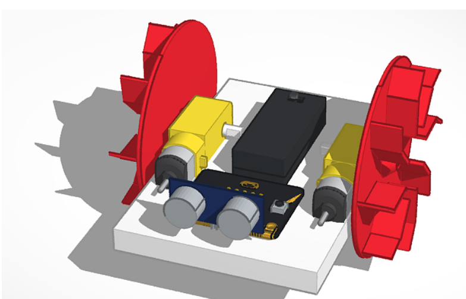

# LimpiapiscinasBot

Interesante proyecto de un limpiador de piscinas OpenSource. 🤔 Ya puestos yo le añadiría un panel solar y que limpie mientras toma el sol el solito... Y cuando no se necesite se puede usar para incordiar a los bañistas o para echar carreras

Inspirado en [este instructable](https://www.instructables.com/id/Skara-Autonomous-Plus-Manual-Swimming-Pool-Cleanin/)

[hilo en twitter](https://twitter.com/javacasm/status/1140919490445750273)

[Robot acuático v0](https://www.tinkercad.com/things/iLhdAoZL2C7)

